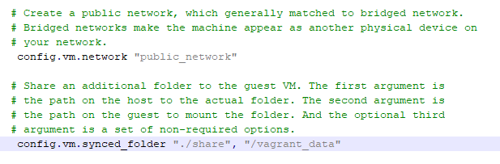
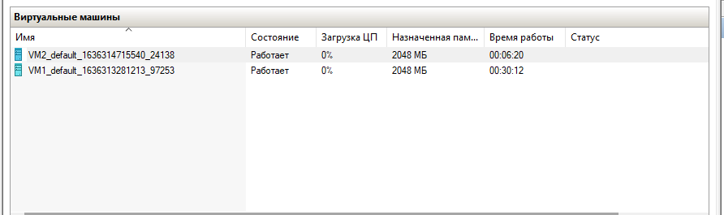

## HyperV and Vagrant ##

I uset to HyperV and have expiriens with a lot off virtuals servers and different network - external, internal and private.

I moved to learnd Vagrant.

**I Instal Vagrant and created work directory**

- init box
>vagrant init generic/ubuntu2004

- Edited vagrantfile

Added publick network (DHCP) and share folders

- Setup and start VM1 and 2

>vagrant up - start  box

- Changed vagrantdfile and reload VM for update setup

>vagrant reload "generic/ubuntu2004"

- Take a snapshot

>vagrant snapshot push

- Save a snapshot
>vagrant snapshot save (create with some name)

>vagrant snapshot delete "snapshotbame"

>vagrant snapshot save forVM3 (name "forVM3")

- EXPORT VM
>vagrant package --output VM3

- Moved VM3 to dir VM3, init new box

>vagrant init VM3

>vagrant up

 - Stop VM
>vagrant halt - shutdown VM

