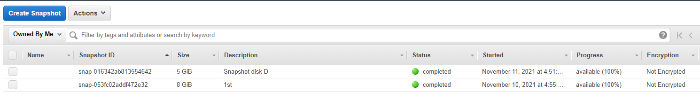

## **TASK2.2** ##

**Amazon Lightsail. Create VM in the AWS cloud and connect to it.** 

**Created instans and get access**

**Take snapshot**

**Add EBS extended storadge, attached to instance, mount like /media/share.**
**Reboot mashine, check**

I create new instanse VM2 from snapshot VM1, but one created in different Availability Zone us-east-2c (VM1 and Disk_D  us-east-2a).
I tok shapshot for disk_D, and created new disk_D from this snapshot in target AZ - us-east-2c. Attached to VM2, mount in OS and chek.

**Lightsail. Created WP Site**

**Created backet**

**S3 work trough CLI**

**Created domenNAME**
>fluggegecheimen.click

**Instaled and configurate Docker in EC2**

**Pushed image to Amazon ECR (Elastic Container Registry)**

**Created Cluster ans added Task Definition some types images: DockerHUB and ECR**

[fluggegecheimen.click](www.fluggegecheimen.click)

