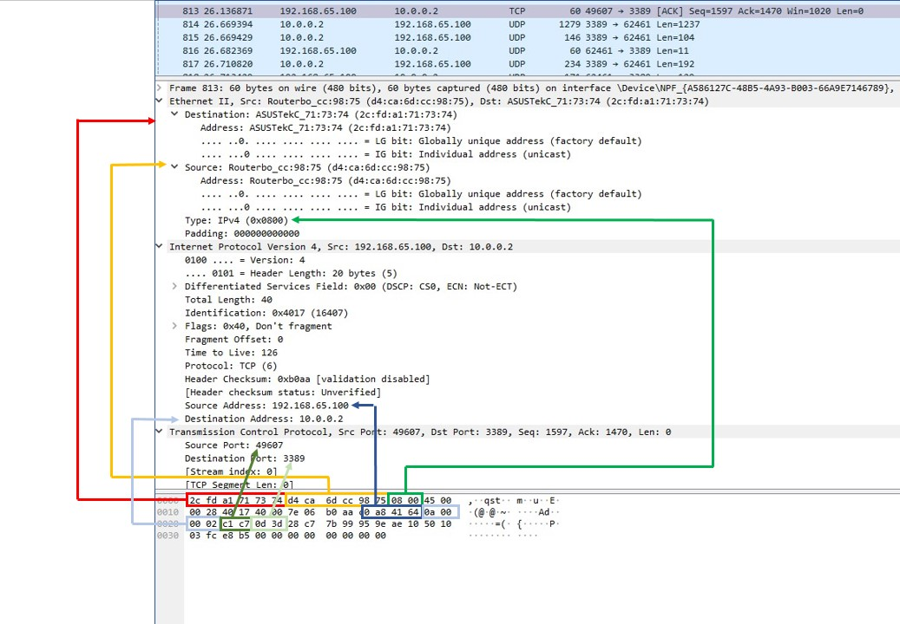

# **Task 3.1** #
[Cisco Packet Tracer File](/Task3.1.pkt)

Created networks zones.

Packed analized with Wireshart

# **Task 3.2** #
[Cisco Packet Tracer File](/Task3.2.pkt)

**Create internet nertwork**

**Tested Data Centr network with mak 255.255.255.192**

Hosts 10.3.0.50 - .100 - .150 didn't ping wich other becouse hosts ip adress belong different networks and does't have any routes.

10.3.0.50 with mask 255.255.255.192 has adress range: from 10.3.0.0 to 10.3.0.63

10.3.0.100 with mask 255.255.255.192 has adress range: from 10.3.0.64 to 10.3.0.127

10.3.0.150 with mask 255.255.255.192 has adress range: from 10.3.0.128 64 to 10.3.0.191

Separated Data Center hosts betwen VLAN - will have same result - router dosn't have routes.

After added connection on Router3 betwen VLANs 2-3-4 i got good ping

>Router(config-if)# interface GigabitEthernet0/0.2

>Router(config-subif)#encapsulation dot1Q 2

>Router(config-subif)#ip address 10.3.0.1 255.255.255.192

>Router(config-if)# interface GigabitEthernet0/0.3

>Router(config-subif)#encapsulation dot1Q 3

>Router(config-subif)#ip address 10.3.0.65 255.255.255.192

>Router(config-if)# interface GigabitEthernet0/0.4

>Router(config-subif)#encapsulation dot1Q 4

>Router(config-subif)#ip address 10.3.0.129 255.255.255.192

# **Task 3.3** #

Added statick routes for VLANs

Ping from PC1 to WEB 2

Turn on RIP auto routing (RIP 1 didn't work, I configurated RIP2)

**CLI**
>router rip

>verison 2

>network

# **Task 3.4** #

DHCP Server enabled, check PC1-2

PC3-Home WiFi Router

DNS Server setup

