# **Task 4** #

**Install MySQL Server to Ubuntu**

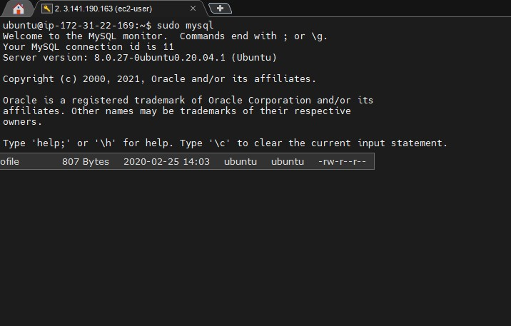


Connect Worbench to MySQL

SET GLOBAL validate_password.special_char_count = 0;

>CREATE USER 'root'@'localhost' IDENTIFIED BY 'password';

>GRANT ALL PRIVILEGES ON * . * TO 'newuser'@'localhost';

>FLUSH PRIVILEGES;

>SELECT user,authentication_string,plugin,host FROM mysql.user;


**Create DATABASE**

- work with DB

>CREATE DATABASE dbmane;

>SHOW DATABASES;

>USE dbname;

>DROP DATABASE dbname;

- work with tables
> SHOW TABLES

```
>CREATE TABLE students
(
    Id INT,
    FirstName VARCHAR(20),
    LastName VARCHAR(20),
    Age INT
);
```

>SHOW COLUMNS FROM tbname;

>RENAME TABLE old_tbname TO new_tbname;

>TRUNCATE TABLE tbname; // clear table

>DROP TABLE tbname;

**Created DB with tablets**

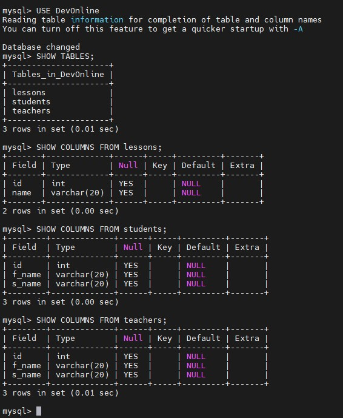


- Fill data to tables

```
INSERT students (id, f_name, s_name) 
VALUES
(1, 'Igor', 'Sinelnik')
(2, 'Vasia' 'Pupkin')
(3, 'Вера','Петрова')
;
```
> SELECT * FROM students;

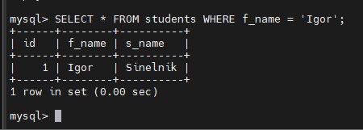

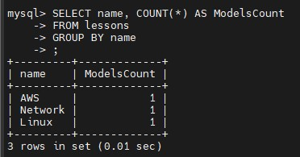

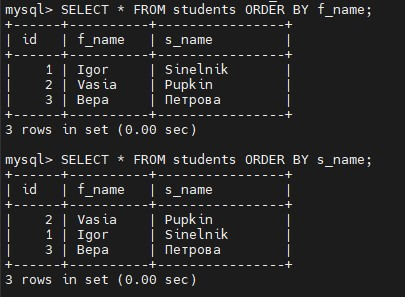

**Test backupe - Restore**

>sudo mysqldump DevOnline > /home/ubuntu/DevOnline.sql

>DROP TABLE lessons;

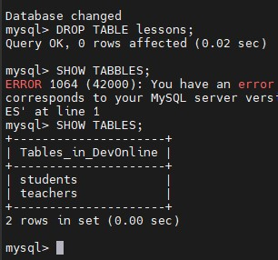

>sudo mysql DevOnline < /home/ubuntu/DevOnline.sql

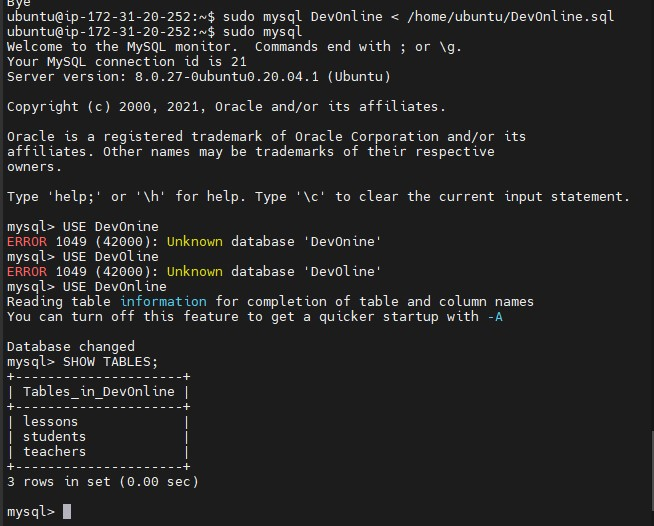


## Transfer Db backup to AWS ##

> sudo apt install awscli

> aws configure

```
aws s3 cp /home/ubuntu/DevOnline.sql s3://dbdevonlinebackup/
upload: ./DevOnline.sql to s3://dbdevonlinebackup/DevOnline.sql
//Restore from S3 doesn't work for t2.micro servers...
```

 sudo mysql -h devonline.cyr5wdrsdhcd.us-east-2.rds.amazonaws.com devonline -u root -p < /home/ubuntu/DevOnline.sql

 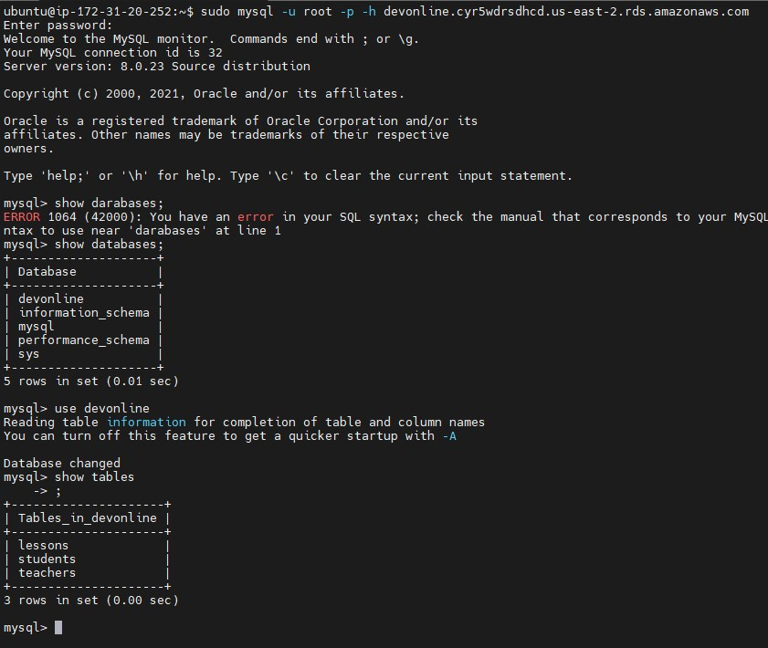

 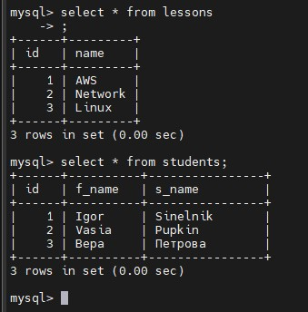

 **Created dump and upload to s3**

```
 sudo mysqldump -h devonline.cyr5wdrsdhcd.us-east-2.rds.amazonaws.com devonline -u root -p > /home/ubuntu/DevOnline_rds.sql

 aws s3 cp /home/ubuntu/DevOnline_rds.sql s3://dbdevonlinebackup/
```
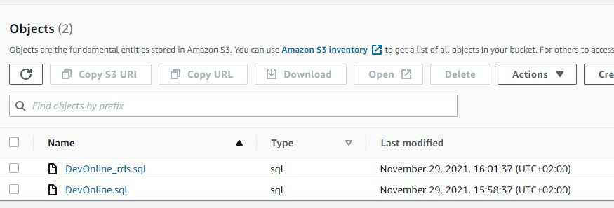

- Or snapshot

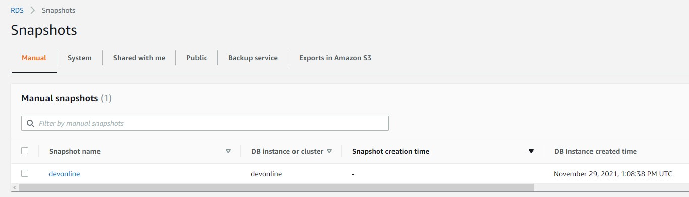

## DynamoDB ##

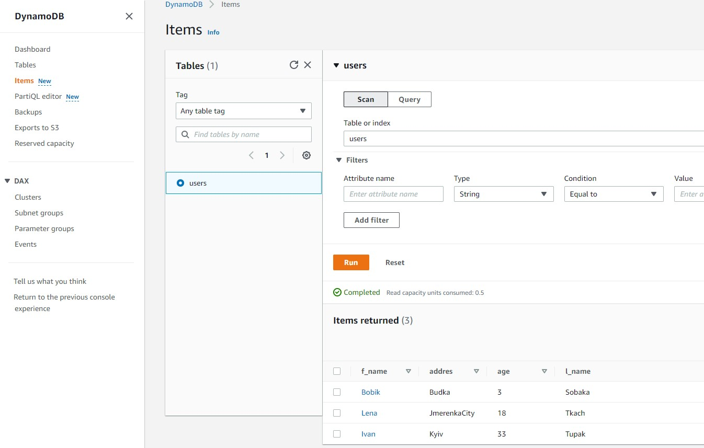


| Тип      | Ссылка |
|----------|---------|
|Install MySQL|https://www.digitalocean.com/community/tutorials/how-to-install-mysql-on-ubuntu-20-04-ru|
|Password polices |https://blog.programs74.ru/how-to-resolve-mysql-error-1819/|
|Права|https://www.digitalocean.com/community/tutorials/mysql-ru
|DB constructor |https://ondras.zarovi.cz/sql/demo/|


