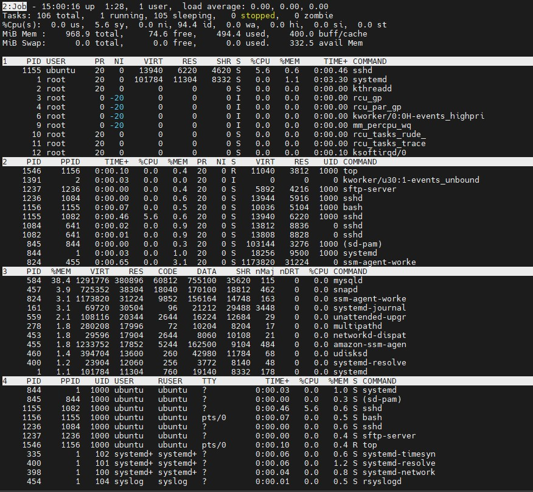
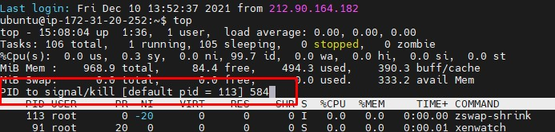

# Task 5.3 #

## Part 1 ##

- 1

How many states could has a process in Linux?
```
1. RUNNING & RUNNABLE
2. INTERRRUPTABLE_SLEEP
3. UNINTERRUPTABLE_SLEEP
4. STOPPED
5. ZOMBIE
```

- 2

 Examine the pstree command. Make output (highlight) the chain (ancestors) of the current
process
```
ubuntu@ip-172-31-20-252:~$ pstree root -a
systemd
  ├─accounts-daemon
  │   └─2*[{accounts-daemon}]
  ├─acpid
  ├─agetty -o -p -- \\u --keep-baud 115200,38400,9600 ttyS0 vt220
  ├─agetty -o -p -- \\u --noclear tty1 linux
  ├─amazon-ssm-agen
  │   ├─ssm-agent-worke
  │   │   └─7*[{ssm-agent-worke}]
  │   └─7*[{amazon-ssm-agen}]
  ├─atd -f
  ├─cron -f
  ├─dbus-daemon --system --address=systemd: --nofork --nopidfile --systemd-activation --syslog-only
  ├─multipathd -d -s
  │   └─6*[{multipathd}]
  ├─mysqld
  │   └─36*[{mysqld}]
  ├─networkd-dispat /usr/bin/networkd-dispatcher --run-startup-triggers
  ├─polkitd --no-debug
  │   └─2*[{polkitd}]
  ├─rsyslogd -n -iNONE
  │   └─3*[{rsyslogd}]
  ├─snapd
  │   └─8*[{snapd}]
  ├─sshd
  │   ├─sshd
  │   │   └─sshd                                                                                         ...
  │   │       └─bash
  │   │           └─pstree root -a
  │   └─sshd
  │       └─sshd                                                                                         ...
  │           └─sftp-server
  ├─systemd --user
  │   └─(sd-pam)
  ├─systemd-journal
  ├─systemd-logind
  ├─systemd-network
  ├─systemd-resolve
  ├─systemd-timesyn
  │   └─{systemd-timesyn}
  ├─systemd-udevd
  ├─udisksd
  │   └─4*[{udisksd}]
  └─unattended-upgr /usr/share/unattended-upgrades/unattended-upgrade-shutdown --wait-for-signal
      └─{unattended-upgr}
```

- 3

What is a proc file system?

The proc filesystem is a pseudo-filesystem which provides an interface to kernel data structures.  It is commonly mounted at /proc.

- 4

Print information about the processor (its type, supported technologies, etc.).
```
ubuntu@ip-172-31-20-252:/$ sudo lshw -class cpu
  *-cpu
       description: CPU
       product: Intel(R) Xeon(R) CPU E5-2676 v3 @ 2.40GHz
       vendor: Intel Corp.
       physical id: 401
       bus info: cpu@0
       slot: CPU 1
       size: 2400MHz
       capacity: 2400MHz
       width: 64 bits
       capabilities: fpu fpu_exception wp vme de pse tsc msr pae mce cx8 apic sep mtrr pge mca cmov pat pse36 clflush mmx fxsr sse sse2 ht syscall nx rdtscp x86-64 constant_tsc rep_good nopl xtopology cpuid tsc_known_freq pni pclmulqdq ssse3 fma cx16 pcid sse4_1 sse4_2 x2apic movbe popcnt tsc_deadline_timer aes xsave avx f16c rdrand hypervisor lahf_lm abm cpuid_fault invpcid_single pti fsgsbase bmi1 avx2 smep bmi2 erms invpcid xsaveopt
```

- 5

Use the ps command to get information about the process. The information should be as
follows: the owner of the process, the arguments with which the process was launched for
execution, the group owner of this process, etc

-A - all procces
-d - with shadow process

-F - more information
-H - show process tree
```
ubuntu@ip-172-31-20-252:/$ ps -Ad -FH

root         490       1  0  1840  2128   0 10:31 ttyS0    00:00:00   /sbin/agetty -o -p -- \u --keep-baud 11
root         498       1  0  1459  1748   0 10:31 tty1     00:00:00   /sbin/agetty -o -p -- \u --noclear tty1
root         513       1  0 59108  8776   0 10:31 ?        00:00:00   /usr/lib/policykit-1/polkitd --no-debug
root         566       1  0 27029 16516   0 10:31 ?        00:00:00   /usr/bin/python3 /usr/share/unattended-
mysql        578       1  0 322944 359288 0 10:31 ?        00:00:09   /usr/sbin/mysqld
root         641       1  0  3046  5812   0 10:31 ?        00:00:00   sshd: /usr/sbin/sshd -D -o AuthorizedKe
root        5898     641  0  3452  7592   0 11:20 ?        00:00:00     sshd: ubuntu [priv]
ubuntu      6004    5898  0  3485  5396   0 11:20 ?        00:00:03       sshd: ubuntu@pts/0
ubuntu      6005    6004  0  2542  5108   0 11:20 pts/0    00:00:00         -bash
ubuntu      6403    6005  0  2696  3376   0 12:17 pts/0    00:00:00           ps -Ad -FH

```

- 6

How to define kernel processes and user processes?

It can define by procces UID.

- 7

Print the list of processes to the terminal. Briefly describe the statuses of the processes.
What condition are they in, or can they be arriving in?
```
Last login: Fri Dec 10 13:36:48 2021 from 212.90.164.182
ubuntu@ip-172-31-20-252:~$ ps -aux
USER         PID %CPU %MEM    VSZ   RSS TTY      STAT START   TIME COMMAND
root           1  0.2  1.1 101784 11248 ?        Ss   13:31   0:03 /sbin/init
root           2  0.0  0.0      0     0 ?        S    13:31   0:00 [kthreadd]
root           3  0.0  0.0      0     0 ?        I<   13:31   0:00 [rcu_gp]
root          13  0.0  0.0      0     0 ?        I    13:31   0:00 [rcu_sched]
root          25  0.0  0.0      0     0 ?        SN   13:31   0:00 [ksmd]
root         161  0.0  3.0  69720 30184 ?        S<s  13:32   0:00 /lib/systemd/systemd-journald
root         278  0.0  1.8 280208 17996 ?        SLsl 13:32   0:00 /sbin/multipathd -d -s
systemd+     335  0.0  0.5  90008  5844 ?        Ssl  13:32   0:00 /lib/systemd/systemd-timesyncd
root         488  0.0  0.2   7360  2364 ttyS0    Ss+  13:32   0:00 /sbin/agetty -o -p -- \u --keep-baud 11520
root         824  0.0  3.1 1173820 31224 ?       Sl   13:32   0:00 /snap/amazon-ssm-agent/4046/ssm-agent-work
ubuntu      1238  0.0  0.3  10820  3676 pts/0    R+   13:52   0:00 ps -aux

```
```
PROCESS STATE CODES
       Here are the different values that the s, stat and state output specifiers (header "STAT" or "S") will display to describe the state of a process:
       D    uninterruptible sleep (usually IO)
       R    running or runnable (on run queue)
       S    interruptible sleep (waiting for an event to complete)
       T    stopped, either by a job control signal or because it is being traced.
       W    paging (not valid since the 2.6.xx kernel)
       X    dead (should never be seen)
       Z    defunct ("zombie") process, terminated but not reaped by its parent.

       For BSD formats and when the stat keyword is used, additional characters may be displayed:
       <    high-priority (not nice to other users)
       N    low-priority (nice to other users)
       L    has pages locked into memory (for real-time and custom IO)
       s    is a session leader
       l    is multi-threaded (using CLONE_THREAD, like NPTL pthreads do)
       +    is in the foreground process group.
```

- 8

Display only the processes of a specific user.

```
ubuntu@ip-172-31-20-252:~$ ps -aFu root
UID          PID    PPID  C    SZ   RSS PSR STIME TTY          TIME CMD
root           1       0  0 25446 11248   0 13:31 ?        00:00:03 /sbin/init
root           2       0  0     0     0   0 13:31 ?        00:00:00 [kthreadd]
root           3       2  0     0     0   0 13:31 ?        00:00:00 [rcu_gp]
root           4       2  0     0     0   0 13:31 ?        00:00:00 [rcu_par_gp]
root           6       2  0     0     0   0 13:31 ?        00:00:00 [kworker/0:0H-events_highpri]
root           9       2  0     0     0   0 13:31 ?        00:00:00 [mm_percpu_wq]
root          10       2  0     0     0   0 13:31 ?        00:00:00 [rcu_tasks_rude_]
root          11       2  0     0     0   0 13:31 ?        00:00:00 [rcu_tasks_trace]

```

```
ubuntu@ip-172-31-20-252:~$ ps -aFu ubuntu
UID          PID    PPID  C    SZ   RSS PSR STIME TTY          TIME CMD
ubuntu       844       1  0  4564  9500   0 13:36 ?        00:00:00 /lib/systemd/systemd --user
ubuntu       845     844  0 25786  3276   0 13:36 ?        00:00:00 (sd-pam)
ubuntu      1155    1082  0  3485  6220   0 13:52 ?        00:00:00 sshd: ubuntu@pts/0
ubuntu      1156    1155  0  2509  5100   0 13:52 pts/0    00:00:00 -bash
ubuntu      1236    1084  0  3486  5916   0 13:52 ?        00:00:00 sshd: ubuntu@notty
ubuntu      1237    1236  0  1473  4216   0 13:52 ?        00:00:00 /usr/lib/openssh/sftp-server
ubuntu      1274    1156  0  2656  3260   0 14:03 pts/0    00:00:00 ps -aFu ubuntu

```

- 9

What utilities can be used to analyze existing running tasks (by analyzing the help for the ps
command)?

>  pgrep(1), pstree(1), top(1), proc(5).

```
ubuntu@ip-172-31-20-252:~$ pgrep ssh
641
1082
1084
1155
1236
ubuntu@ip-172-31-20-252:~$ pgrep sql
584
```

```
ubuntu@ip-172-31-20-252:~$ pstree root
systemd─┬─accounts-daemon───2*[{accounts-daemon}]
        ├─acpid
        ├─2*[agetty]
        ├─amazon-ssm-agen─┬─ssm-agent-worke───6*[{ssm-agent-worke}]
        │                 └─7*[{amazon-ssm-agen}]
        ├─atd
        ├─cron
        ├─dbus-daemon
        ├─multipathd───6*[{multipathd}]
        ├─mysqld───36*[{mysqld}]
        ├─networkd-dispat
        ├─polkitd───2*[{polkitd}]
        ├─rsyslogd───3*[{rsyslogd}]
        ├─snapd───8*[{snapd}]
        ├─sshd─┬─sshd───sshd───bash───pstree
        │      └─sshd───sshd───sftp-server
        ├─systemd───(sd-pam)
        ├─systemd-journal
        ├─systemd-logind
        ├─systemd-network
        ├─systemd-resolve
        ├─systemd-timesyn───{systemd-timesyn}
        ├─systemd-udevd
        ├─udisksd───4*[{udisksd}]
        └─unattended-upgr───{unattended-upgr}
ubuntu@ip-172-31-20-252:~$ pstree ubuntu
sshd───bash───pstree

sshd───sftp-server

systemd───(sd-pam)
```

- 10

What information does top command display?

top - default task manager, it shows information about all process in real time - usage cpu, memory..

- 11

Display the processes of the specific user using the top command.

```
ubuntu@ip-172-31-20-252:~$ top -u root
top - 14:50:37 up  1:18,  1 user,  load average: 0.00, 0.00, 0.00
Tasks: 106 total,   1 running, 105 sleeping,   0 stopped,   0 zombie
%Cpu(s):  0.0 us,  0.3 sy,  0.0 ni, 99.7 id,  0.0 wa,  0.0 hi,  0.0 si,  0.0 st
MiB Mem :    968.9 total,     74.8 free,    494.3 used,    399.9 buff/cache
MiB Swap:      0.0 total,      0.0 free,      0.0 used.    332.6 avail Mem

    PID USER      PR  NI    VIRT    RES    SHR S  %CPU  %MEM     TIME+ COMMAND
      1 root      20   0  101784  11304   8332 S   0.0   1.1   0:03.30 systemd
      2 root      20   0       0      0      0 S   0.0   0.0   0:00.00 kthreadd
      3 root       0 -20       0      0      0 I   0.0   0.0   0:00.00 rcu_gp
      4 root       0 -20       0      0      0 I   0.0   0.0   0:00.00 rcu_par_gp
      6 root       0 -20       0      0      0 I   0.0   0.0   0:00.00 kworker/0:0H-events_highpri
      9 root       0 -20       0      0      0 I   0.0   0.0   0:00.00 mm_percpu_wq
     10 root      20   0       0      0      0 S   0.0   0.0   0:00.00 rcu_tasks_rude_
     11 root      20   0       0      0      0 S   0.0   0.0   0:00.00 rcu_tasks_trace
     12 root      20   0       0      0      0 S   0.0   0.0   0:00.10 ksoftirqd/0
     13 root      20   0       0      0      0 I   0.0   0.0   0:00.56 rcu_sched
     14 root      rt   0       0      0      0 S   0.0   0.0   0:00.02 migration/0
     15 root     -51   0       0      0      0 S   0.0   0.0   0:00.00 idle_inject/0
     16 root      20   0       0      0      0 S   0.0   0.0   0:00.00 cpuhp/0
     17 root      20   0       0      0      0 S   0.0   0.0   0:00.00 kdevtmpfs
```

```
ubuntu@ip-172-31-20-252:~$ top -u mysql
top - 14:51:46 up  1:19,  1 user,  load average: 0.00, 0.00, 0.00
Tasks: 106 total,   1 running, 105 sleeping,   0 stopped,   0 zombie
%Cpu(s):  0.0 us,  0.0 sy,  0.0 ni,100.0 id,  0.0 wa,  0.0 hi,  0.0 si,  0.0 st
MiB Mem :    968.9 total,     74.8 free,    494.3 used,    399.9 buff/cache
MiB Swap:      0.0 total,      0.0 free,      0.0 used.    332.6 avail Mem

    PID USER      PR  NI    VIRT    RES    SHR S  %CPU  %MEM     TIME+ COMMAND
    584 mysql     20   0 1291776 380896  35620 S   0.0  38.4   0:06.91 mysqld
```

- 12

What interactive commands can be used to control the top command? Give a couple of
examples


Yoy can push A for view all windows- def, job, mem, usr.



Kill procces - push k, and than put PID




- 13

Sort the contents of the processes window using various parameters (for example, the
amount of processor time taken up, etc.)

   -o  :Override-sort-field as:  -o fieldname


```

    PID USER      PR  NI    VIRT    RES    SHR S  %CPU  %MEM     TIME+ COMMAND
    584 mysql     20   0 1291776 380812  35536 S   0.0  38.4   0:08.39 mysqld
    457 root      20   0  725352  38304  18812 S   0.0   3.9   0:03.03 snapd
    824 root      20   0 1173820  31224  14748 S   0.0   3.1   0:00.66 ssm-agent-worke
    161 root      19  -1   69720  30528  29512 S   0.0   3.1   0:00.45 systemd-journal
    559 root      20   0  108116  20344  12684 S   0.0   2.1   0:00.07 unattended-upgr
    455 root      20   0 1235160  18072   9104 S   0.0   1.8   0:02.65 amazon-ssm-agen
    278 root      rt   0  280208  17996   8204 S   0.0   1.8   0:00.38 multipathd
    453 root      20   0   29596  17904  10108 S   0.0   1.8   0:00.07 networkd-dispat
    460 root      20   0  394704  13600  11784 S   0.0   1.4   0:00.04 udisksd
    400 systemd+  20   0   23904  12060   8140 S   0.0   1.2   0:00.08 systemd-resolve
      1 root      20   0  101784  11304   8332 S   0.0   1.1   0:03.31 systemd
    844 ubuntu    20   0   18256   9500   8164 S   0.0   1.0   0:00.03 systemd
```

```

    PID USER      PR  NI    VIRT    RES    SHR S  %CPU  %MEM     TIME+ COMMAND
    113 root       0 -20       0      0      0 I   0.0   0.0   0:00.00 zswap-shrink
     91 root      20   0       0      0      0 S   0.0   0.0   0:00.01 xenwatch
     90 root      20   0       0      0      0 S   0.0   0.0   0:00.00 xenbus
     75 root      20   0       0      0      0 S   0.0   0.0   0:00.00 xen-balloon
     23 root       0 -20       0      0      0 I   0.0   0.0   0:00.00 writeback
     81 root     -51   0       0      0      0 S   0.0   0.0   0:00.00 watchdogd
    100 root       0 -20       0      0      0 I   0.0   0.0   0:00.00 vfio-irqfd-clea
    559 root      20   0  108116  20344  12684 S   0.0   2.1   0:00.07 unattended-upgr
    460 root      20   0  394704  13600  11784 S   0.0   1.4   0:00.04 udisksd
     76 root       0 -20       0      0      0 I   0.0   0.0   0:00.00 tpm_dev_wq
   1817 ubuntu    20   0   11040   3864   3292 R   0.0   0.4   0:00.01 top
    193 root      20   0   19096   5524   4064 S   0.0   0.6   0:00.07 systemd-udevd
    335 systemd+  20   0   90008   5844   5148 S   0.0   0.6   0:00.06 systemd-timesyn
    400 systemd+  20   0   23904  12060   8140 S   0.0   1.2   0:00.08 systemd-resolve
    398 systemd+  20   0   26736   7840   6892 S   0.0   0.8   0:00.04 systemd-network
    458 root      20   0   16828   7696   6828 S   0.0   0.8   0:00.06 systemd-logind
```

- 14


|Type|Link|
|----|----|
|Process|https://ravesli.com/processes-v-linux/|
